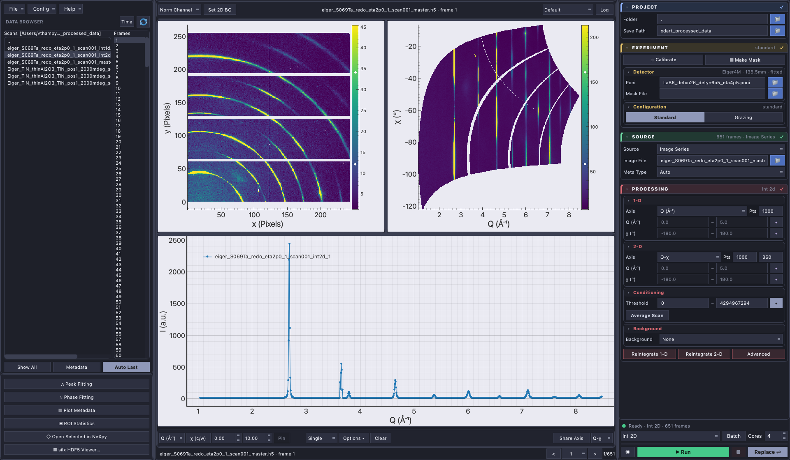
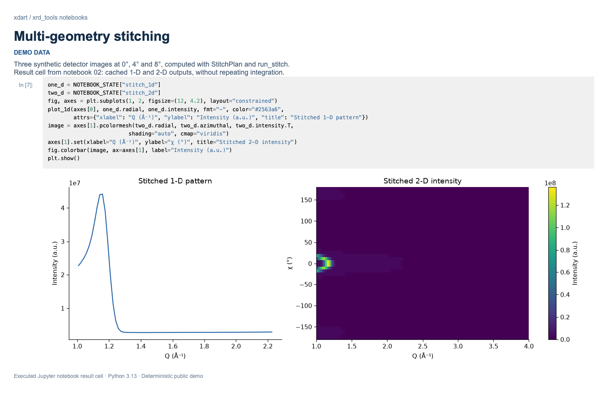
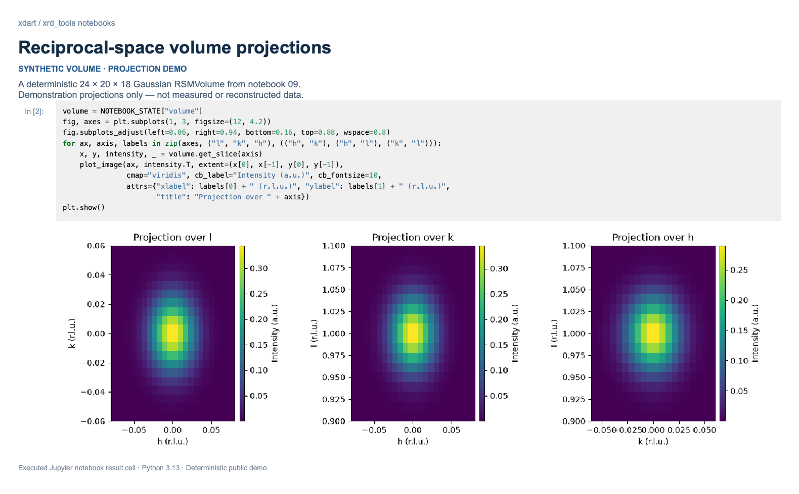

# xdart

<!-- After the repo is pushed, point the badge at the real org/name:
[](https://github.com/<org>/xdart/actions/workflows/pr.yml) -->

**X-ray diffraction processing and analysis, from live acquisition to notebooks.**

**xdart** is a desktop application for real-time and batch X-ray diffraction
analysis. It uses [pyFAI](https://pyfai.readthedocs.io/) for azimuthal integration,
the [pyFAI fiber module](https://pyfai.readthedocs.io/en/latest/api/pyFAI.html#module-pyFAI.integrator.fiber)
for grazing-incidence processing, and
[xrayutilities](https://xrayutilities.sourceforge.io/) for stitching and
reciprocal-space mapping.

The Scattering Workspace brings integration, processed-data browsing, 1D/2D
viewers, and notebook export into one window. It supports NeXus and XYE output,
with stitching and reciprocal-space mapping (RSM) coming soon to the GUI.

xdart's processing and analysis functions are also available through
**`xrd_tools`**, its headless Python core, for scripts, Jupyter notebooks, and
automated batch pipelines without Qt. The
[example notebooks](examples/notebooks/README.md) cover integration,
grazing incidence, stitching, reciprocal-space mapping, peak/phase/strain
fitting, and analysis of processed results.

---

<a id="install"></a>

## Quick start

1. **[Install Pixi](https://pixi.sh/latest/installation/)**, then open a new
   terminal. You do not need to install Python or conda separately.

2. **Install xdart:**

   ```bash
   pixi global install -c https://prefix.dev/xrd-tools -c conda-forge xdart
   ```

3. **Launch xdart** by clicking its app/shortcut in Applications (macOS), the
   Start menu (Windows), or the application menu (Linux). Or run:

   ```bash
   xdart
   ```

To update later, close xdart and run `pixi global update xdart`.

[Alternate installation methods and more details](docs/INSTALLATION.md)

For Python scripts and Jupyter, start with the
[headless integration notebook](examples/notebooks/06_headless_reduction_pipeline.ipynb).
The [notebook gallery](examples/notebooks/README.md) has more `xrd_tools` API
examples for processing, plotting, and analysis.

<details>
<summary>Contents</summary>

- [Quick start](#quick-start)
- [The GUI (`xdart`)](#the-gui-xdart)
  - [Launching xdart](#launching-xdart)
  - [Key capabilities](#key-capabilities)
  - [GUI quick start](#gui-quick-start)
  - [Usage guide](#usage-guide)
  - [Analyze Results notebooks](#analyze-results-notebooks)
  - [Configuration & calibration](#configuration--calibration)
  - [Troubleshooting](#troubleshooting)
- [Headless quick start (`xrd_tools`)](#headless-quick-start-xrd_tools)
  - [Notebook examples](#notebook-examples)
- [Library features](#library-features)
- [Headless API guide](#headless-api-guide)
  - [Basic integration](#basic-integration)
  - [Unit conversion](#unit-conversion)
  - [Multiple scans and live ingestion](#multiple-scans-and-live-ingestion)
  - [Grazing incidence](#grazing-incidence)
  - [Reciprocal space mapping](#reciprocal-space-mapping)
  - [Reading processed scan files](#reading-processed-scan-files)
  - [Peak & phase fitting](#peak--phase-fitting)
- [Intensity corrections](#intensity-corrections)
- [Development](#development)
- [Contributing](#contributing)
- [License](#license)
- [Citation](#citation)
- [Acknowledgments](#acknowledgments)
- [Contact](#contact)

</details>

---

## The GUI (`xdart`)

### Launching xdart

After a Pixi global installation, click the **xdart app/shortcut** in your
Applications folder (macOS), Start menu (Windows), or application menu (Linux).
Alternatively, launch it from a terminal:

```bash
xdart
```

For an editable Pixi installation, run `pixi run --locked xdart` from its
workspace instead.

xdart is a pyFAI-based desktop GUI for real-time azimuthal integration and
visualization of synchrotron X-ray diffraction data, built with PySide6 and
pyqtgraph for high-performance interactive plotting. Live **and** batch
acquisition stream through the **same** headless reduction spine (parallel
pyFAI workers and a single writer). The GUI displays completed results from
the saved NeXus or XYE output.



### Key capabilities

- **Real-time 1D/2D azimuthal integration** using pyFAI.
- **Batch processing** of image series with parallel multicore support.
- **Grazing-incidence diffraction (GID)** integration using pyFAI
  `FiberIntegrator`.
- **Live monitoring** of ongoing experiments with directory-watched file
  ingestion.
- **NeXus/HDF5 data format** with full metadata preservation; portable
  Project-Folder relative-path storage.
- **Interactive 2D detector-image visualization** with zoom, pan, and masking.
- **Unit conversion** between Q (Å⁻¹) and 2θ (°) with wavelength awareness.
- **Background subtraction** (single file, series average, or
  directory-matched).
- **Masking tools** for bad pixels, beamstop shadows, and detector edges.
- **Calibration management** via PONI files with visual feedback.
- **Raw-image preview thumbnails** for quick file browsing.
- **Automatic metadata discovery** — the Meta Type selector defaults to `auto`:
  per-image sidecar metadata (`.txt`, `.pdi`, QXRD-style
  `image.tif.metadata`, and other structured name=value sidecars) is found and
  parsed automatically; choose `none` to disable or `spec` for SPEC files.
- **Overlay / Waterfall comparison across scans** — overlay 1D patterns and
  slice cuts from multiple frames, and **pin** the current slice cut (Cmd+P)
  to keep it on the plot for comparison; the overlay survives compatible scan
  boundaries, so cuts from successive scans (e.g. a chi-texture series) can be
  compared directly.

### GUI quick start

**Basic workflow:**

1. **Launch xdart** and wait for the main window to open.
2. **Set calibration**: browse and select your PONI calibration file in the
   right panel.
3. **Select data**: choose an image file or directory containing images.
4. **Choose processing mode**: **Int 1D**, **Int 2D**, or **Int 1D (XYE)** in
   the dropdown beside Run. Set the Project folder and Save Path for output.
5. **Configure parameters**: choose axes, point counts, background subtraction,
   the global mask, and intensity thresholds as needed. **Batch** suppresses
   intermediate plot updates for faster processing.
6. **Click Run**: processing begins; monitor progress and view results in
   real time.

### Usage guide

#### Processing and viewing modes

| Mode | Purpose |
| --- | --- |
| **Int 1D** | Integrate 1D patterns and save a processed `.nexus` file. |
| **Int 2D** | Integrate 1D patterns and 2D maps into a processed `.nexus` file. |
| **Int 1D (XYE)** | Save individual text patterns containing axis, intensity, and uncertainty; browse them with the 1D viewer after completion. |
| **Stitch 1D**, **Stitch 2D**, **RSM** | Specialized analysis entries; Stitch 2D is currently disabled in the GUI. |
| **1D Viewer** | Browse XYE and other supported 1D data without integrating. |
| **2D Viewer** | Browse raw detector images or the raw images associated with processed NeXus files. |

**Batch** is a separate performance toggle: it suppresses intermediate plots
and displays the saved result after completion. Set **Cores** to control worker
parallelism. Image Series reads frames from a selected source; Image Directory
adds file-type, metadata-type, filter, and subdirectory controls.

#### Append vs Replace

The write-mode toggle (Cmd+Shift+A) controls whether a run **appends** new
frames to the existing processed `.nexus` or **replaces** it. Re-running Append
on an already-processed scan is near-instant: frames already in the output are
skipped. Use Append to continue a stopped NeXus run with compatible settings;
use Replace to reprocess after changing the integration configuration.
Append is not available for **Int 1D (XYE)**.

#### Live acquisition

Monitor a directory for new image files and integrate them as they arrive —
real-time feedback during an active beamline experiment.

1. Set the PONI file and image directory.
2. Choose Int 1D or Int 2D and enable Live acquisition.
3. Click Run.
4. xdart watches the directory and processes new files automatically.

The **Run** button becomes **Pause / Resume** during processing; **Stop** ends
the run and closes its output.

#### Keyboard shortcuts

Use Cmd on macOS and Ctrl on Linux/Windows:

- **Cmd+R** — Run / Pause / Resume the current processing run.
- **Cmd+Shift+C** — Stop the run.
- **Cmd+Shift+A** — toggle the write mode between Append and Replace.
- **Cmd+P** — pin the current slice cut (adds it to the Overlay).
- **Cmd+O** / **Cmd+S** — load / save the xdart settings (Config).

#### Browsing and comparison

Select a file in **Scans**, then navigate its **Frames** with the mouse or arrow
keys. **Single** follows the current selection; modifier keys select several
patterns for comparison. Dense selections are displayed as a waterfall.
**Overlay** retains patterns as you navigate, while the browser highlights the
current selection. Use **Clear** to reset the comparison.

The **Open Selected in NeXpy** button opens the selected processed file in
[NeXpy](https://nexpy.github.io/nexpy/) for further NeXus data exploration.
The **silx HDF5 Viewer** button launches
[silx view](https://silx.readthedocs.io/en/stable/applications/view.html) to browse
HDF5 datasets, images, and metadata. Both viewers are included with the GUI
installation. Processed files may reference their original raw images: retain
those images when moving a project.

#### Integration axes and units

The 1D integration panel's axis dropdown offers:

- **Q (Å⁻¹)**: scattering-vector magnitude; independent of wavelength.
- **2θ (°)**: scattering angle; depends on the wavelength in your PONI file.

The 2D integration panel offers:

- **Q-χ**: radial-azimuthal in reciprocal space.
- **2θ-χ**: radial-azimuthal in angle space.

Unit conversion respects your calibration file's wavelength automatically.

#### Grazing-incidence diffraction (GID)

For surface-sensitive measurements, xdart supports grazing-incidence geometry
using pyFAI's `FiberIntegrator`:

1. Select **Experiment → Configuration → Grazing**.
2. Choose the incidence-angle motor or a manual angle using the **θ motor**
   controls. Use Advanced settings for sample orientation when needed.
3. The integrator panel switches to GI-specific modes:
   - **1D modes**: Qip (in-plane), Qoop (out-of-plane), Q-total.
   - **2D modes**: Qip-Qoop, Q-χ.
4. Process as normal; output reflects the rotated reciprocal-space axes.

#### Advanced integration settings

Click **Advanced** in the Processing panel for detailed pyFAI
parameters:

- **Solid-angle correction**: account for detector solid-angle variations.
- **Dummy values**: mark pixels to ignore in integration.
- **Polarization factor**: apply polarization correction for synchrotron
  radiation.
- **Integration method**: choose the algorithm (e.g. histogram, csr,
  full-split).
- **Radial range**: manually clip the Q or 2θ range (overrides auto-detection).
- **Azimuthal range**: select only certain χ sectors.

#### Intensity thresholds and the global mask

The **Threshold** control replaces the separate Mask Saturated button. When
enabled, it accepts the inclusive intensity range on **each frame**. Its automatic
range starts at zero and ends one count below the detector/data-type saturation
limit: for uint16 data, **0–65,534** excludes every pixel at **65,535**. The limit
is determined once from the native detector/data type, not from the brightest
pixel in each image.

Edit the bounds to reject a different intensity range; clearing the upper bound
restores automatic saturation rejection. With Threshold disabled, finite pixels
are retained regardless of saturation or intensity. Nonfinite values are still
invalid. The **global mask file is always honored**, whether Threshold is on or
off, and Threshold also works when no mask file is specified.

#### Background subtraction

Configure in **Processing → Background**:

- **No background**: raw data only.
- **Single file**: subtract a single dark image.
- **Series average**: average all images in a background directory, then
  subtract.
- **Directory-matched**: match each sample image to a background image by
  filename pattern.

Background frames are integrated with the same parameters as sample frames for
consistency.

#### Calibration and masking

The integrator panel includes **Calibrate** and **Make Mask** buttons:

- **Calibrate** launches the pyFAI-calib2 module for interactive detector
  calibration. Use a calibration standard (e.g. LaB6, CeO2) to refine detector
  geometry and generate a PONI file.
- **Make Mask** launches the pyFAI mask-drawing tool to interactively draw
  regions on a detector image and create/edit a bad-pixel mask.

Load the static mask under **Experiment → Detector → Mask File**. Use
**Processing → Conditioning → Threshold** for dynamic, per-frame intensity
rejection.

#### Data export and saving

- **Int 1D / Int 2D** save processed NeXus files under the Project Save Path.
- **Int 1D (XYE)** saves text patterns in a scan-specific output directory.
- NeXus output carries processing metadata and calibration information for
  subsequent analysis.

### Analyze Results notebooks

After a run, choose **Help → Export Analyze Results Notebook…** to save a Jupyter
notebook for the selected processed NeXus file or XYE results. It includes the
output paths, loading code, metadata access, and example plots using `xrd_tools`.
Data is loaded on demand; exporting the notebook does not rerun the integration
or copy the data files.

Open it in an environment with `xdart[notebook]`, such as the
[notebook Pixi workspace](docs/INSTALLATION.md#headless--notebooks-with-pixi) or
[editable install](docs/INSTALLATION.md#editable-install-with-pixi-recommended),
and run `pixi run jupyter lab`. If you move the results, update the paths
in the notebook before running its cells.

### Configuration & calibration

#### PONI files

xdart uses pyFAI PONI (PyFAI Object Containing Necessary Information) files for
detector calibration. A PONI file contains:

- detector geometry (pixel size, shape, name),
- incident-beam center location,
- sample-to-detector distance,
- wavelength,
- detector rotation (if any).

Generate a PONI file with the **Calibrate** button in xdart's integrator panel
(which launches pyFAI-calib2), or from the command line:

```bash
pyFAI-calib2
```

Refer to the pyFAI documentation for detailed calibration procedures.

### Troubleshooting

**pyFAI installation fails on macOS/Windows:**
Install via conda instead of pip; conda packages include pre-built binaries.

```bash
conda install -c conda-forge pyfai
```

**GUI doesn't appear or crashes on startup:**
Check that PySide6 is installed and your Qt plugins are accessible:

```bash
python -c "from PySide6 import QtWidgets; print('PySide6 OK')"
```

**Slow integration or freezing:**
Ensure multicore processing is enabled, and reduce the radial resolution if
working with very large detectors.

**PONI file not recognized:**
Verify the PONI file is text-based `key=value` pairs and that paths are
absolute or relative to the working directory.

**Memory use on a low-RAM machine:**
Lower **Cores** to reduce simultaneous raw-frame and integration buffers.
Processed-data browsing loads image data on demand; the frame count alone does
not determine how many full detector images remain resident.

---

## Headless quick start (`xrd_tools`)

The canonical reduction path — the one the GUI itself drives — is the
streaming reduction spine: choose a `ReductionPlan`, supply a `Scan`, point it
at a sink.

```python
from xrd_tools.reduction import (
    Integration1DPlan, Integration2DPlan, NexusSink,
    ReductionPlan, Scan, run_reduction,
)

plan = ReductionPlan(
    integration_1d=Integration1DPlan(npt=1000, unit="q_A^-1"),
    integration_2d=Integration2DPlan(npt_rad=1000, npt_azim=360),
)
scan = Scan("scan1", frames, integrator=ai)        # frames: list[ScanFrame]
run_reduction(plan, scan,
              sink=NexusSink("processed/scan1.nexus",
                             source_base="/path/to/project"))
```

The sink writes the complete, portable v2 record: integrated 1D/2D stacks,
per-frame raw-source pointers (relative to the project root), thumbnails,
scan metadata, and per-frame geometry. Reading back:

```python
from xrd_tools.io import get_1d, get_raw_frame, open_scan, read_frame_view

scan = open_scan("processed/scan1.nexus")          # notebook sugar
q, intensity, sigma, unit, frames = get_1d("processed/scan1.nexus")
view = read_frame_view("processed/scan1.nexus", 0) # one frame, display-ready
raw = get_raw_frame("processed/scan1.nexus", 0)    # resolves the source pointer
```

### Notebook examples

The [stitching notebook](examples/notebooks/02_multigeometry_stitching.ipynb)
combines diffraction images from multiple geometries. This example uses
deterministic demonstration data.



The [RSM notebook](examples/notebooks/09_reciprocal_space_mapping.ipynb)
demonstrates plotting projections of a reciprocal-space volume. The screenshot
uses a synthetic volume to illustrate the viewing tools.



---

## Library features

- **1D/2D azimuthal integration** — fast azimuthal integration via pyFAI with
  full detector-geometry support.
- **Grazing-incidence diffraction (GID)** — specialized integration for
  surface-sensitive and thin-film measurements (pyFAI `FiberIntegrator`).
- **Multi-geometry stitching** — combine multiple detector angles into a
  seamless extended-Q 1D/2D pattern.
- **Reciprocal-space mapping (RSM)** — build 3D reciprocal-space volumes with
  HKL gridding (`[rsm]`).
- **Streaming reduction spine** — parallel pyFAI workers + a single writer
  thread, bounded in-flight memory, **fail-loud** `finish()` (a failed write
  raises, never silently succeeds).
- **NeXus/HDF5 I/O** — standards-compliant, schema-strict stacked v2 records;
  full NumPy/pandas object serialization via the HDF5 codec.
- **Portable raw-source paths** — Project-Folder mode stores raw pointers
  relative to the project root, so a processed dataset moves machines intact.
- **SPEC file parsing** — scan commands, geometries, counter data, metadata.
- **Peak fitting** — lmfit-based single- and multi-peak fitting with
  selectable backgrounds (linear, constant, Chebyshev, polynomial, SNIP)
  (`[fitting]`).
- **Phase pattern fitting** — multi-phase pseudo-Voigt fitting with
  pymatgen-derived peak positions and template intensities (`PhaseFitter`)
  (`[fitting]`).
- **Strain analysis** — sin²(ψ) method for biaxial stress/strain, with
  optional (E, ν) inputs for direct stress output (`[fitting]`).
- **Batch processing** — directory watching and automated pipeline execution.

> **Roadmap (not yet implemented):** texture analysis (pole figures, ODF),
> Rietveld/LeBail refinement, automated phase matching against structure
> databases, additional standalone correction modules. The corresponding
> `analysis/texture.py`, `analysis/refinement.py` entries are placeholders
> reserved for these features. Likewise `xrd_tools.gui.main` is a reserved
> standalone-launcher entry point (raises `NotImplementedError`) — use `xdart`.

---

## Headless API guide

Use `xrd_tools` for headless processing and analysis. For complete workflows,
see the [example notebooks](examples/notebooks/README.md).

### Basic integration

`integrate_1d` / `integrate_2d` take a detector image **and a configured
pyFAI integrator** (not a PONI directly — build the integrator from a PONI
with `poni_to_integrator`).

```python
from xrd_tools.io import read_image, write_nexus
from xrd_tools.integrate import load_poni, poni_to_integrator, integrate_1d

# Load calibration and build a pyFAI integrator
poni = load_poni("path/to/calibration.poni")
ai = poni_to_integrator(poni)

# Read a detector image
img = read_image("path/to/image.h5")

# Azimuthal integration -> IntegrationResult1D (.radial, .intensity, .sigma, .unit)
result_1d = integrate_1d(img, ai, npt=1000, unit="q_A^-1")

# Save to NeXus
write_nexus("output.nexus", result_1d)
```

### Unit conversion

Energy is passed as `energy_keV`. d-spacing helpers are `q_to_d` / `d_to_q`
(there is no `tth_to_dspacing` — convert via `tth_to_q` then `q_to_d`).

```python
from xrd_tools.transforms import tth_to_q, q_to_d, d_to_q

q = tth_to_q(two_theta, energy_keV=15.0)   # 2theta (deg) -> Q (A^-1)
d = q_to_d(q)                              # Q (A^-1) -> d-spacing (A)
q = d_to_q(d)                              # d-spacing (A) -> Q (A^-1)
```

### Multiple scans and live ingestion

Drive each scan through the same `run_reduction(..., NexusSink(...))` path shown
in the headless quick start. The xdart GUI owns directory watching and live
ingestion; the former `integrate.process_series` / `DirectoryWatcher` flat-HDF5
pipeline was retired because it did not produce the current processed schema.

### Grazing incidence

GI integration uses a pyFAI `FiberIntegrator`, built from a PONI plus the
grazing-incidence geometry, then integrated with an `incident_angle`.

```python
from xrd_tools.integrate import create_fiber_integrator, integrate_gi_1d

fi = create_fiber_integrator(poni, incident_angle=0.2)   # degrees
result_gi = integrate_gi_1d(img, fi, unit="qoop_A^-1", incident_angle=0.2)
```

`integrate_gi_2d`, `integrate_gi_polar_1d`, and `integrate_gi_exitangles_1d`
cover the 2D cake, polar, and exit-angle modes respectively.

### Reciprocal space mapping

```python
from xrd_tools.rsm import ExperimentConfig, RSMVolume

config = ExperimentConfig(...)     # crystal structure + Q-space geometry
volume = RSMVolume(...)            # build a 3D reciprocal-space grid
rsm_data = volume.to_hkl_grid()    # map to HKL
```

(`ExperimentConfig` / `RSMVolume` constructor signatures are illustrative —
see `xrd_tools.rsm` for the current parameters. Requires the `[rsm]` extra.)

### Reading processed scan files

Once a scan has been reduced (by xdart or the headless pipeline) the results
live in a current NeXus `.nexus` file. The `get_*` convenience readers pull 1D / 2D
patterns, thumbnails, and metadata back out in one line — no xarray knowledge
required. A processed file is a **scan**; each reader takes a **frame** index
(or `None` for all frames).

```python
from xrd_tools.io import (
    get_frames, get_metadata, get_1d, get_2d, get_thumbnail, open_scan,
)

get_frames("scan.nexus")              # frame labels
meta = get_metadata("scan.nexus")     # sample, energy, wavelength, axes, motors
q, intensity, sigma, unit, frames = get_1d("scan.nexus")    # all frames
cake = get_2d("scan.nexus", 2)        # frame 2 — (chi, q) oriented

# object-style sugar
scan = open_scan("scan.nexus")
scan.frames, len(scan), scan.get_1d(2), scan.metadata
```

For per-frame, display-ready reconstruction (the reload half of the
live≡batch≡reload equivalence spine) use `read_frame_view` /
`read_frame_views`.

### Peak & phase fitting

```python
from xrd_tools.analysis.phase import PhaseModel
from xrd_tools.analysis.fitting.phase_fitting import PhaseFitter

# Build a phase from a CIF and compute its peaks
phase = PhaseModel.from_cif("Fe.cif", name="alpha-Fe")
phase.calculate_peaks(q_range=(1.0, 7.0))

# Fit a measured 1D pattern with one or more phases
fitter = PhaseFitter(q, intensity, background="snip")
fitter.add_phase(phase)
result = fitter.fit(fitter.build_params())
```

Structure-agnostic single-/multi-peak fitting lives under
`xrd_tools.analysis.fitting` (lmfit-based, selectable backgrounds). Requires
the `[fitting]` extra.

---

## Intensity corrections

The value in each (q, χ) cake cell or RSM voxel is only physically meaningful once per-pixel
**intensity corrections** are applied. They divide out instrumental/geometric factors so what
remains is proportional to the sample's scattering. Two groups:

**Detector / beam (apply to any integration):**

- **Solid angle.** A flat-panel pixel far from the beam centre is farther away and viewed
  obliquely, so it subtends a smaller solid angle Ω (∝ cos³2θ) and collects fewer photons for
  the same scattered intensity. Dividing by Ω converts counts → intensity-per-solid-angle and
  boosts the high-angle pixels. (pyFAI applies this by default.)
- **Polarization.** Synchrotron light is ~linearly polarized; Thomson scattering is suppressed
  along the polarization direction, imprinting a 2θ- and azimuth-dependent modulation on the
  rings. Dividing by the polarization factor removes it. (Set the degree of polarization,
  ≈ 0.99 horizontal at most beamlines.)
- **Lorentz, dark/flat/efficiency, air absorption.** Standard powder/detector corrections; Lorentz
  is a geometric weighting usually folded into 1D integration.

**Grazing incidence** (gated to GI mode; built from `xrayutilities` optics, n = 1 − δ + iβ,
critical angle αc = √2δ, with exit angle αf = arcsin(qz/k − sin αi)):

- **Footprint / illuminated area.** At grazing αi the beam spreads over a footprint ∝ 1/sin αi;
  for a sample larger than the beam the illuminated scattering volume grows with it, so measured
  intensity does too. The correction (× sin αi) normalizes it (a global scale at fixed αi;
  per-frame when αi is scanned).
- **Refraction.** The beam refracts at the surface (δ ~ 10⁻⁶); the true angles inside the film
  are αi′ = √(αi²−αc²), αf′ = √(αf²−αc²), which shift the apparent qz / ring positions near αc.
  Below αc the wave is evanescent.
- **Penetration / absorption.** Probed depth depends sharply on αi vs αc (nm below, µm above),
  and both the αi and αf paths are attenuated over the absorption length μ⁻¹. The correction
  accounts for the αi/αf-dependent path length, boosting strongly-absorbed grazing-exit pixels.
- **Fresnel transmission / Vineyard (DWBA).** |T(αi)|² and |T(αf)|² peak at αc — the bright
  **Yoneda band**. Measured intensity carries |T(αi)|²|T(αf)|²; dividing it out removes the
  Yoneda enhancement and recovers the true scattering.

Implemented as a per-pixel weight stack at the accumulator seam — solid-angle/polarization
reuse pyFAI arrays, the GI stack uses `xu.materials`. Interactive demo with on/off toggles, an αi slider and a
material selector: `examples/notebooks/02_multigeometry_stitching.ipynb`.

---

## Development

See the [editable Pixi setup](docs/INSTALLATION.md#editable-install-with-pixi-recommended)
for macOS, Linux, and Windows, and the
[test and packaging commands](docs/INSTALLATION.md#tests-and-packaging).

---

## Contributing

Contributions are welcome. Fork the repository, create a feature branch
(`git checkout -b my-feature`), make your changes with tests, and submit a
pull request with a clear description. For bug reports or feature requests,
open an issue on the GitHub repository.

## License

First-party code is released under the **MIT License** (see
[LICENSE](https://github.com/v-thampy/xdart/blob/main/LICENSE)). Portions of
the headless core retain their
[BSD-3-Clause license](licenses/LICENSE-ssrl_xrd_tools).
SPDX: `MIT AND BSD-3-Clause`.

## Citation

If you use xdart or its `xrd_tools` core in your research, please cite:

```
xdart: SSRL X-ray diffraction toolkit (headless reduction core + xdart GUI)
https://github.com/v-thampy/xdart
```

(Formal publication citation coming soon.)

## Acknowledgments

Developed at the [Stanford Synchrotron Radiation Lightsource
(SSRL)](https://www-ssrl.slac.stanford.edu/), SLAC National Accelerator
Laboratory.

xdart relies on the scientific work and software developed by these projects:

- **[pyFAI](https://pyfai.readthedocs.io/)** provides the azimuthal integration
  algorithms at the heart of xdart's processing.
- **[pyFAI's fiber module (FiberIntegrator)](https://pyfai.readthedocs.io/en/latest/api/pyFAI.html#module-pyFAI.integrator.fiber)**
  provides the grazing-incidence integration used for thin-film analysis.
- **[xrayutilities](https://xrayutilities.sourceforge.io/)** provides reciprocal-space
  coordinate conversion and gridding used by both stitching and RSM.
- **[NeXpy](https://nexpy.github.io/nexpy/)** provides the external NeXus viewer
  and interactive analysis environment available from xdart's Data Browser.
- **[silx](https://silx.readthedocs.io/en/stable/)** provides scientific I/O tools
  and the [silx view](https://silx.readthedocs.io/en/stable/applications/view.html)
  application used for general HDF5 inspection.

We gratefully acknowledge their authors, maintainers, and contributors. Please
also cite the relevant underlying packages when publishing results obtained with
xdart. Thanks also to the NumPy, SciPy, lmfit, and pymatgen communities, and to
the collaborators and users who provide feedback and improvements.

## Contact

For questions, feedback, or collaboration inquiries:

**Vivek Thampy** — vthampy@stanford.edu
